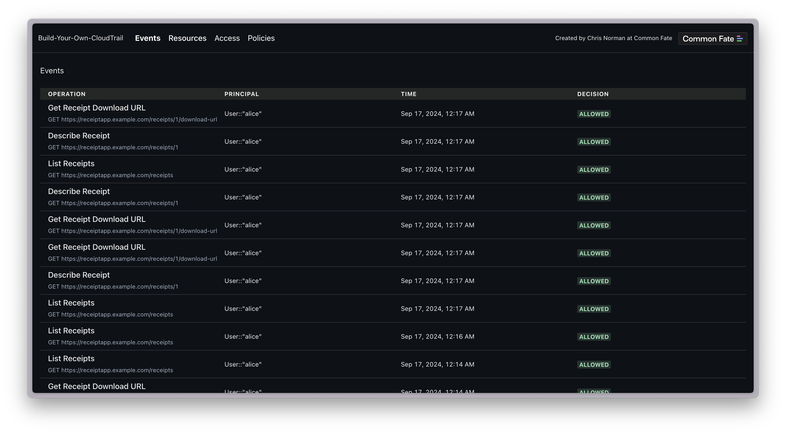
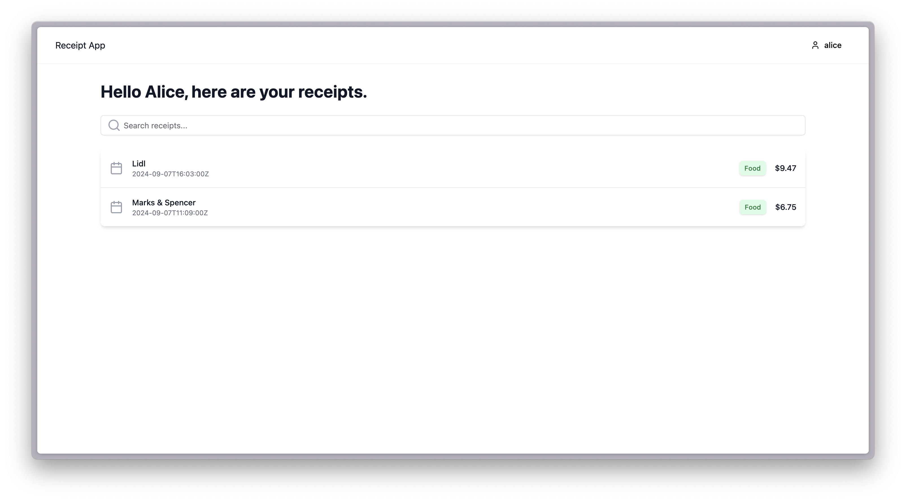
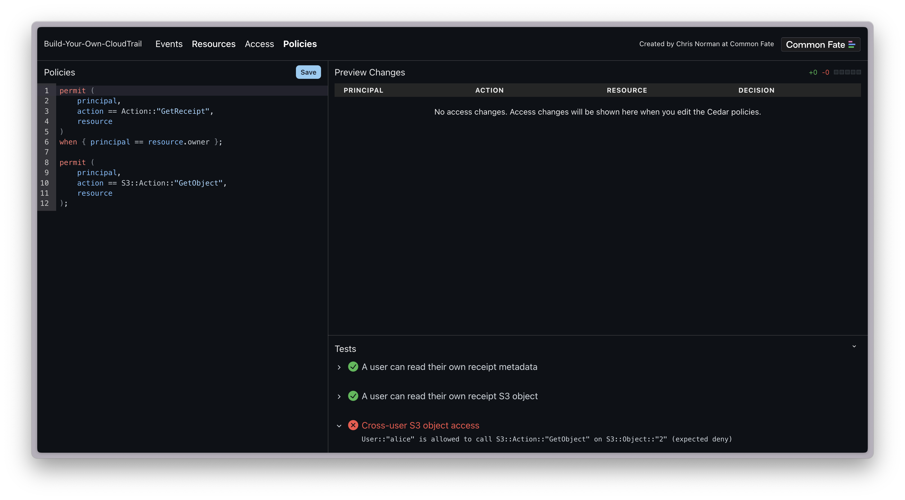

# build-your-own-cloudtrail



An example repository detailing how to use Cedar to secure your services running in the cloud, complete with your own CloudTrail-style authorization audit log. Presented at [fwd:cloudsec EU 2024](https://fwdcloudsec.org/conference/europe/).

The example cloud workload being secured is a receipt tracing application.



## Running Locally

To run this example you'll need NodeJS, [pnpm](https://pnpm.io/installation) and Go installed on your machine.

Run the Control Plane API:

```bash
go run cmd/server/main.go
```

Run the Control Plane web interface:

```bash
cd admin
pnpm run dev
```

Run the Receipt App API:

```bash
go run cmd/receiptapp/main.go
```

Run the Receipt App UI:

```bash
cd web
pnpm run dev
```

The Control Plane will be available at http://localhost:3002, and the Receipt App will be available at http://localhost:5173.

## Edit Cedar Policies

Visit http://localhost:3002/ to edit Cedar policies. The Control Plane UI will show the impact of your authorization changes.


